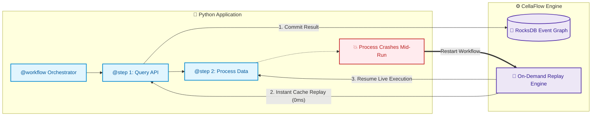
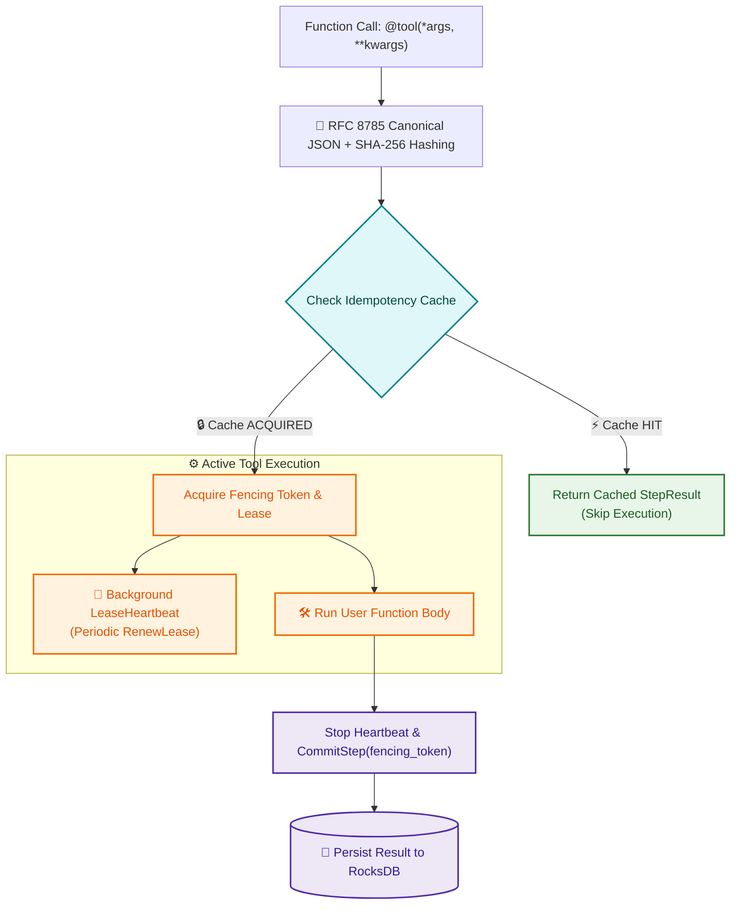

# Cellaflow Python SDK

The official Python SDK for the [CellaFlow Engine](https://www.cellaflow.com) — providing durable execution, deterministic replay recovery, and swarm-safe concurrency primitives for AI workflows and multi-agent systems.

[](https://github.com/cellaflow/cellaflow-sdks/actions/workflows/ci.yml)
[](https://github.com/cellaflow/cellaflow-sdks/actions/workflows/ci.yml)
[](https://pypi.org/project/cellaflow/)
[](https://pypi.org/project/cellaflow/)
[](https://github.com/cellaflow/cellaflow-sdks/blob/main/LICENSE)

---

## Features

- 🔄 **Durable Execution & Transparent Replay**: Workflows survive process restarts and infrastructure crashes without re-executing completed steps.
- ⚡ **Zero-Friction Decorators**: Annotate standard Python functions with `@workflow`, `@step`, and `@tool` (supporting both `def` and `async def`).
- 🧠 **LangGraph Drop-in Checkpointer**: Native `CellaflowSaver` checkpointer for LangGraph workflows with immutable MessagePack state snapshots, time-travel, and crash recovery.
- 🛡️ **Deterministic Idempotency**: Automatic input hashing via RFC 8785 Canonical JSON and SHA-256 guarantees cross-language determinism across multi-agent swarms.
- 🔒 **Background Lease Management**: Non-blocking heartbeat management keeps engine locks alive and eliminates split-brain execution using fencing tokens.
- 📦 **Secure Serialization**: Strictly uses MessagePack for all state payloads to optimize throughput over gRPC and eliminate Remote Code Execution (RCE) deserialization vectors.

---

## Installation

### Core SDK
For standard durable execution workflows, decorators, and gRPC client:
```bash
pip install cellaflow
```

### With LangGraph Support
To use `CellaflowSaver` as a drop-in LangGraph checkpointer:
```bash
pip install "cellaflow[langgraph]"
```

> **Note on Optional Dependencies**:
> - `pip install cellaflow` installs a lightweight package without pulling in LangGraph, Pydantic, or LangChain.
> - If your environment already contains `langgraph >= 0.2.0` and `langgraph-checkpoint >= 2.0.0`, `from cellaflow import CellaflowSaver` will work immediately out of the box.
> - Installing `cellaflow[langgraph]` ensures that compatible `langgraph` and `langgraph-checkpoint` versions are installed or upgraded automatically.

---

## Quickstart

### 1. Synchronous Workflow

```python
from cellaflow import workflow, step, tool, IdempotencyScope

# 1. Define tools with automatic caching and idempotency
@tool(scope=IdempotencyScope.SCOPE_SESSION_WIDE)
def search_web(query: str) -> dict:
    """Simulates an expensive API or web search tool."""
    print(f"Executing web search for: {query}")
    return {"query": query, "results": ["CellaFlow Overview", "Durable Execution Docs"]}

# 2. Define intermediate steps
@step
def summarize_results(data: dict) -> str:
    return f"Processed {len(data['results'])} items for '{data['query']}'"

# 3. Define the orchestrating workflow
# By default connects to localhost:50051 (or pass custom target="engine:50051", secure=True)
@workflow(version="1.0.0")
def research_workflow(topic: str) -> str:
    search_data = search_web(topic)
    summary = summarize_results(search_data)
    return summary

if __name__ == "__main__":
    result = research_workflow("autonomous agent architectures")
    print("Result:", result)
```

---

### 2. Asynchronous Workflow & Multi-Agent Swarms

The SDK natively supports `async def` coroutines, asynchronous I/O, and agent isolation:

```python
import asyncio
from cellaflow import workflow, step, tool, IdempotencyScope

@tool(agent_id="researcher_agent", scope=IdempotencyScope.SCOPE_AGENT_PRIVATE)
async def fetch_market_data(ticker: str) -> dict:
    print(f"Fetching live ticker data: {ticker}")
    await asyncio.sleep(0.5)  # Simulate non-blocking async network I/O
    return {"ticker": ticker, "price": 142.50}

@step(agent_id="analyst_agent")
async def analyze_trends(market_data: dict) -> str:
    return f"Signal for {market_data['ticker']}: BUY at ${market_data['price']}"

@workflow(version="1.0.0")
async def swarm_analysis_workflow(ticker: str) -> str:
    data = await fetch_market_data(ticker)
    analysis = await analyze_trends(data)
    return analysis

if __name__ == "__main__":
    result = asyncio.run(swarm_analysis_workflow("CELL"))
    print("Analysis Result:", result)
```

---

### 3. Transparent Replay & Session Recovery

To recover an interrupted execution after a process crash or restart, supply the `_session_id` keyword argument:

```python
# Resumes the workflow from the exact step where it stopped.
# Completed steps are loaded from the engine's event graph and returned with 0ms execution time.
recovered_result = research_workflow(
    "autonomous agent architectures", 
    _session_id="3f7491d9-e932-4467-bcda-370fb5c1a7e4"
)
```

---

### 4. LangGraph Checkpointer (`CellaflowSaver`)

Use `CellaflowSaver` as a drop-in checkpointer for any LangGraph `StateGraph`:

```python
from typing import TypedDict, List
from langgraph.graph import StateGraph, START, END
from cellaflow import CellaflowSaver

# 1. Initialize checkpointer connected to CellaFlow Engine
checkpointer = CellaflowSaver(target="localhost:50051", secure=False)

# 2. Define LangGraph state schema
class WorkflowState(TypedDict):
    query: str
    summary: str

def plan_node(state: WorkflowState) -> dict:
    return {"summary": f"Plan generated for {state['query']}"}

# 3. Build graph
builder = StateGraph(WorkflowState)
builder.add_node("plan", plan_node)
builder.add_edge(START, "plan")
builder.add_edge("plan", END)

# 4. Compile with CellaFlow persistence
app = builder.compile(checkpointer=checkpointer)

# 5. Execute with session tracking
config = {"configurable": {"thread_id": "session-42"}}
result = app.invoke({"query": "AI Agents"}, config)
print("Graph output:", result)

# 6. Time travel / inspect state history
for checkpoint_tuple in checkpointer.list(config):
    print("Checkpoint ID:", checkpoint_tuple.checkpoint["id"])
    print("State snapshot:", checkpoint_tuple.checkpoint["channel_values"])
```

---

## Architecture & How It Works

### 1. Transparent Replay Recovery

If a worker crashes mid-workflow, restarting the workflow with the same session automatically recovers state from the CellaFlow engine's durable event log:



---

### 2. Idempotency & Lease Lifecycle

For external tool calls and multi-agent coordination, `@tool` prevents duplicate tool calls, single-flights in-progress work, and maintains active lock heartbeats:



---

## Core Concepts

### `@workflow(version="1.0.0", target="localhost:50051", secure=False)`
Marks the entry point for a durable workflow execution:
- **Automatic Client Management**: Transparently initializes the underlying gRPC client and session state.
- **Context Isolation**: Uses Python's `contextvars` to manage session context safely across async event loops and threads.
- **Replay State Loader**: Loads completed step history from the engine whenever `_session_id` is supplied.

### `@step` and `@tool`
Decorators for atomic units of execution within a workflow:
```python
@step(
    idempotency_key: Optional[str] = None,
    agent_id: str = "default",
    tool_name: Optional[str] = None,
    scope: IdempotencyScope = IdempotencyScope.SCOPE_SESSION_WIDE,
)
```
- **Idempotency Key Derivation**: Automatically builds a deterministic key using:
  `[Session_ID]:[Workflow_Version]:[Step_Sequence]:[Agent_ID]:[Tool_Name]:[RFC8785_SHA256_Hash]`
- **Replay Interception**: If a step was already completed in the session history, immediately returns the cached output without re-running the function body.
- **Lease Heartbeating**: Automatically runs background heartbeats (`RenewLease`) via daemon threads (sync) or asyncio tasks (async) to keep engine locks refreshed.
- **Lock Release on Failure**: If an unhandled exception occurs, automatically releases the lease with `reason="TOOL_ERROR"`.

### `IdempotencyScope`
Controls how cached step and tool results are shared across multi-agent sessions:
- `IdempotencyScope.SCOPE_SESSION_WIDE` *(Default)*: Cached results are shared across all agents in the session.
- `IdempotencyScope.SCOPE_AGENT_PRIVATE`: Isolates cache hits to the executing `agent_id`.
- `IdempotencyScope.SCOPE_STEP_LOCAL`: Strictly isolates cache hits to the current superstep sequence and `agent_id`.

---

## Low-Level `CellaflowClient`

For advanced use cases requiring manual session management, graph inspection, or custom scheduling, use `CellaflowClient` directly:

```python
from cellaflow import CellaflowClient
from cellaflow.v1.common_pb2 import STEP_STATUS_SUCCESS

# Initialize client
client = CellaflowClient(target="localhost:50051", secure=False)

# 1. Start or resume a session
session_resp = client.start_session(
    workflow_id="manual_workflow", 
    version="1.0.0"
)
session_id = session_resp.session_id

# 2. Inspect session history graph
steps, next_cursor = client.get_graph(session_id=session_id)

# 3. Commit a step result
commit_resp = client.commit_step(
    session_id=session_id,
    sequence=1,
    name="custom_task",
    status=STEP_STATUS_SUCCESS,
    output_payload={"result": "data"}
)

# 4. Clean up channel
client.close()
```

---

## Development Setup

To get up and running with the Python SDK for local development:

1. **Create and activate a virtual environment**:
   ```bash
   cd python
   python3 -m venv venv
   source venv/bin/activate
   ```

2. **Install the SDK in editable mode with development dependencies**:
   ```bash
   pip install -e ".[dev]"
   ```

### Generating Protobufs and Typing Stubs (`.pyi`)

We use `grpcio-tools` and `mypy-protobuf` to generate Python stubs from `.proto` definitions:

```bash
./scripts/generate_protos.sh
```

This compiles protos from `../proto/cellaflow/v1/*.proto` and outputs `*_pb2.py`, `*_pb2_grpc.py`, and `*.pyi` typing stubs into `src/cellaflow/v1/`.

### Running Tests and Linters

```bash
# Run unit tests
pytest

# Formatting & Linting
black src tests
flake8 src tests
mypy src tests
```

---

## License

Apache 2.0 or MIT (see repository root for details).
