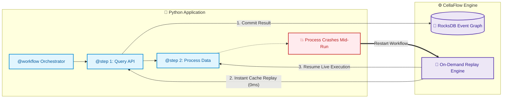
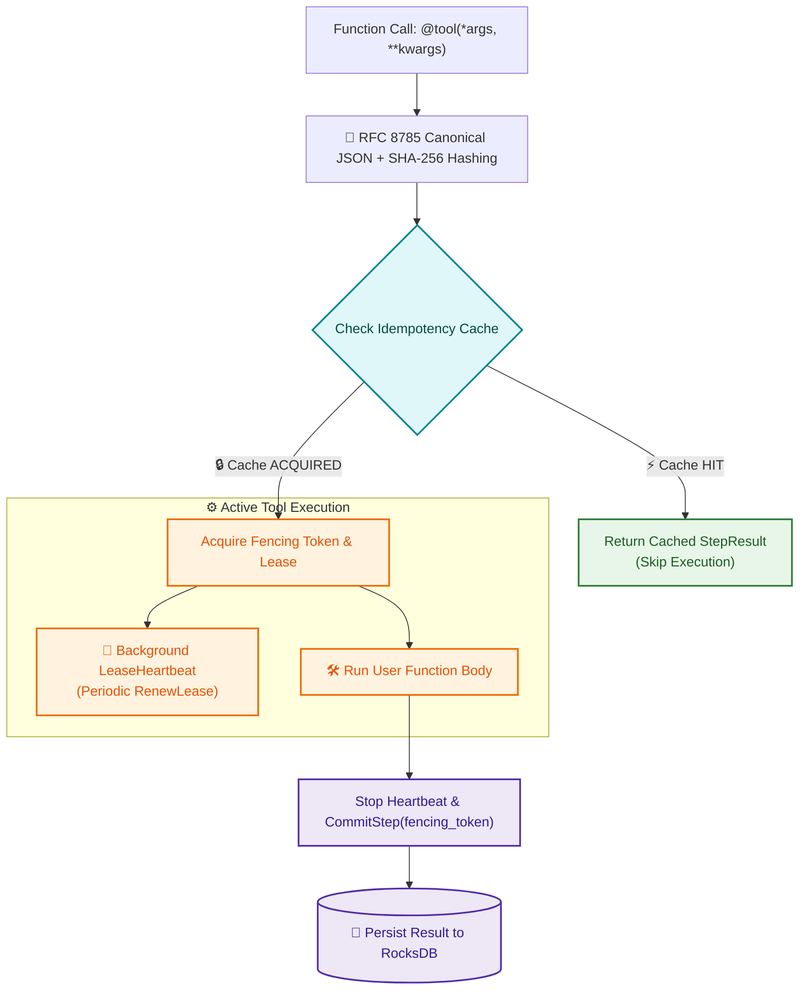

# Cellaflow Python SDK

The official Python SDK for the [CellaFlow Engine](https://www.cellaflow.com) — providing durable execution, deterministic replay recovery, and swarm-safe concurrency primitives for AI workflows and multi-agent systems.

[](https://github.com/cellaflow/cellaflow-sdks/actions/workflows/ci.yml)
[](https://github.com/cellaflow/cellaflow-sdks/actions/workflows/ci.yml)
[](https://pypi.org/project/cellaflow/)
[](https://pypi.org/project/cellaflow/)
[](https://github.com/cellaflow/cellaflow-sdks/blob/main/LICENSE)

---

## Features

- 🔄 **Durable Execution & Transparent Replay**: Workflows survive process restarts and infrastructure crashes without re-executing completed steps.
- ⚡ **Zero-Friction Decorators**: Annotate standard Python functions with `@workflow`, `@step`, and `@tool` (supporting both `def` and `async def`).
- 🧠 **LangGraph Drop-in Checkpointer**: Native `CellaflowSaver` checkpointer for LangGraph workflows with immutable MessagePack state snapshots, time-travel, and crash recovery.
- 💳 **Leased Tool Calls Inside LangGraph Nodes**: `durable_tools` makes a node's irreversible side effect happen at most once — across a crash, a restart, or a resumed thread. A checkpointer makes your state durable; this makes your *charges* durable.
- 🛡️ **Deterministic Idempotency**: Automatic input hashing via RFC 8785 Canonical JSON and SHA-256 guarantees cross-language determinism across multi-agent swarms.
- 🤝 **Cross-Session Coordination**: `SCOPE_SHARED` lets heterogeneous agents — different workflows, different sessions, different versions — converge on a single execution of a shared side effect.
- 🔒 **Background Lease Management**: Non-blocking heartbeat management keeps engine locks alive and eliminates split-brain execution using fencing tokens.
- 📦 **Secure Serialization**: Strictly uses MessagePack for all state payloads to optimize throughput over gRPC and eliminate Remote Code Execution (RCE) deserialization vectors.

---

## Installation

### Core SDK
For standard durable execution workflows, decorators, and gRPC client:
```bash
pip install cellaflow
```

### With LangGraph Support
To use `CellaflowSaver` as a drop-in LangGraph checkpointer:
```bash
pip install "cellaflow[langgraph]"
```

> **Note on Optional Dependencies**:
> - `pip install cellaflow` installs a lightweight package without pulling in LangGraph, Pydantic, or LangChain.
> - If your environment already contains `langgraph >= 0.2.0` and `langgraph-checkpoint >= 2.0.0`, `from cellaflow import CellaflowSaver` will work immediately out of the box.
> - Installing `cellaflow[langgraph]` ensures that compatible `langgraph` and `langgraph-checkpoint` versions are installed or upgraded automatically.

---

## Quickstart

### 1. Synchronous Workflow

```python
from cellaflow import workflow, step, tool, IdempotencyScope

# 1. Define tools with automatic caching and idempotency
@tool(scope=IdempotencyScope.SCOPE_SESSION_WIDE)
def search_web(query: str) -> dict:
    """Simulates an expensive API or web search tool."""
    print(f"Executing web search for: {query}")
    return {"query": query, "results": ["CellaFlow Overview", "Durable Execution Docs"]}

# 2. Define intermediate steps
@step
def summarize_results(data: dict) -> str:
    return f"Processed {len(data['results'])} items for '{data['query']}'"

# 3. Define the orchestrating workflow
# By default connects to localhost:50051 (or pass custom target="engine:50051", secure=True)
@workflow(version="1.0.0")
def research_workflow(topic: str) -> str:
    search_data = search_web(topic)
    summary = summarize_results(search_data)
    return summary

if __name__ == "__main__":
    result = research_workflow("autonomous agent architectures")
    print("Result:", result)
```

---

### 2. Asynchronous Workflow & Multi-Agent Swarms

The SDK natively supports `async def` coroutines, asynchronous I/O, and agent isolation:

```python
import asyncio
from cellaflow import workflow, step, tool, IdempotencyScope

@tool(agent_id="researcher_agent", scope=IdempotencyScope.SCOPE_AGENT_PRIVATE)
async def fetch_market_data(ticker: str) -> dict:
    print(f"Fetching live ticker data: {ticker}")
    await asyncio.sleep(0.5)  # Simulate non-blocking async network I/O
    return {"ticker": ticker, "price": 142.50}

@step(agent_id="analyst_agent")
async def analyze_trends(market_data: dict) -> str:
    return f"Signal for {market_data['ticker']}: BUY at ${market_data['price']}"

@workflow(version="1.0.0")
async def swarm_analysis_workflow(ticker: str) -> str:
    data = await fetch_market_data(ticker)
    analysis = await analyze_trends(data)
    return analysis

if __name__ == "__main__":
    result = asyncio.run(swarm_analysis_workflow("CELL"))
    print("Analysis Result:", result)
```

---

### 3. Coordinating Agents Across Different Sessions

The scopes above deduplicate *within* one session. `SCOPE_SHARED` deduplicates *across* them: several
agents, each running its own workflow in its own session, converge on one execution of a shared
operation.

```python
from cellaflow import workflow, tool, IdempotencyScope

# Same tool_name, same arguments, same coordination_id -> same key.
@tool(tool_name="publish_release_notes", scope=IdempotencyScope.SCOPE_SHARED)
def publish(version: str) -> dict:
    return notes_service.publish(version)   # runs exactly once

@workflow(version="1.0.0")
def coder_agent(version: str) -> dict:
    return publish(version)

@workflow(version="2.3.0")          # a different workflow, on a different version
def doc_writer_agent(version: str) -> dict:
    return publish(version)

# Different sessions, different workflows -- one publish.
coder_agent("v4.2", _coordination_id="release-4.2")
doc_writer_agent("v4.2", _coordination_id="release-4.2")
```

`_coordination_id` names **the work being shared** — a release, a ticket, a task, a tenant — and is
passed at the call site alongside `_session_id`, because it is a property of the collaboration and
not of the tool definition.

It is **required** for `SCOPE_SHARED` and has no default; omitting it raises `ValueError`. A default
would silently deduplicate unrelated callers that happen to make the same call — one agent's
operation is suppressed and it is handed a result it never asked for, with no error raised anywhere.
Making the domain explicit forces that boundary to be a decision rather than an accident. The other
scopes ignore `_coordination_id` if it is passed.

**Three things must match for two agents to converge.** All of them are under your control, and any
one of them being different means both agents execute:

| Must match | Note |
| --- | --- |
| `coordination_id` | Different domains stay isolated. This is what keeps the scope from being too wide. |
| `tool_name` | Defaults to the *function name*. Agents whose functions are named differently must set `tool_name=` explicitly to the same value. |
| Arguments | Hashed with RFC 8785 + SHA-256, so `publish("v4.2")` and `publish("V4.2")` are different operations. |

The derived key drops both `session_id` and `workflow_version`:

```
shared:[coordination_id]:[tool_name]:[RFC8785_SHA256(args)]
```

Dropping the version is deliberate — heterogeneous agents will not be on the same workflow version,
and requiring them to be would defeat the purpose. The consequence is that **changing a shared tool's
behaviour without changing its name or arguments will not produce a new key**, so an agent on the new
version can receive a result produced by the old one. Encode the behaviour change in the arguments,
or in `tool_name`, when that matters.

---

### 4. Transparent Replay & Session Recovery

To recover an interrupted execution after a process crash or restart, supply the `_session_id` keyword argument:

```python
# Resumes the workflow from the exact step where it stopped.
# Completed steps are loaded from the engine's event graph and returned with 0ms execution time.
recovered_result = research_workflow(
    "autonomous agent architectures", 
    _session_id="3f7491d9-e932-4467-bcda-370fb5c1a7e4"
)
```

> **The workflow body must be deterministic.** A resumed run has to call the same steps in the same order as the run it is recovering. Put anything that varies — model output, clocks, random values, network reads — *inside* a step, never in the code that decides which steps to call. See [Replay determinism](#replay-determinism) for why, and for the error you get if you break it.

---

### 5. LangGraph Checkpointer (`CellaflowSaver`)

Use `CellaflowSaver` as a drop-in checkpointer for any LangGraph `StateGraph`:

```python
from typing import TypedDict, List
from langgraph.graph import StateGraph, START, END
from cellaflow import CellaflowSaver

# 1. Initialize checkpointer connected to CellaFlow Engine
checkpointer = CellaflowSaver(target="localhost:50051", secure=False)

# 2. Define LangGraph state schema
class WorkflowState(TypedDict):
    query: str
    summary: str

def plan_node(state: WorkflowState) -> dict:
    return {"summary": f"Plan generated for {state['query']}"}

# 3. Build graph
builder = StateGraph(WorkflowState)
builder.add_node("plan", plan_node)
builder.add_edge(START, "plan")
builder.add_edge("plan", END)

# 4. Compile with CellaFlow persistence
app = builder.compile(checkpointer=checkpointer)

# 5. Execute with session tracking
config = {"configurable": {"thread_id": "session-42"}}
result = app.invoke({"query": "AI Agents"}, config)
print("Graph output:", result)

# 6. Time travel / inspect state history
for checkpoint_tuple in checkpointer.list(config):
    print("Checkpoint ID:", checkpoint_tuple.checkpoint["id"])
    print("State snapshot:", checkpoint_tuple.checkpoint["channel_values"])
```

---

### 6. Leased Tool Calls Inside LangGraph Nodes (`durable_tools`)

A checkpointer makes your graph's **state** durable. It does nothing for a
node's **side effects** — if a node charges a customer and the pod dies before
the next checkpoint lands, the resumed run re-enters that node and charges
again.

`durable_tools` closes that window. Wrap the invocation, and any `@tool` called
inside a node body is leased: it runs at most once per thread, across crashes
and restarts.

```python
from cellaflow import CellaflowSaver, durable_tools, tool

@tool(tool_name="issue_refund")
def issue_refund(ticket_id: str, cents: int) -> dict:
    return payment_gateway.charge(ticket_id, cents)   # irreversible

def refund_node(state):
    return {"receipt": issue_refund(state["ticket"], state["amount"])}

app = builder.compile(checkpointer=CellaflowSaver(target="localhost:50051"))
config = {"configurable": {"thread_id": "ticket-4417"}}

with durable_tools(config):
    app.invoke({"ticket": "T-4417", "amount": 2499}, config)
```

If that process dies after the charge and a new one resumes the thread,
LangGraph re-runs the pending node, the tool is reached a second time, and the
lease answers from the recorded result instead of calling the gateway. The
customer is charged once. `examples/multi_agent_idempotency` scenario 5
demonstrates exactly this, killing the process between the charge and the
checkpoint.

**Use the context manager rather than assembling the equivalent yourself.** A
tool's idempotency key is derived from its session id, and `durable_tools`
derives that session from the thread — stable across restarts, so the lease
still recognises the earlier attempt, and separate from the checkpointer's own
session, so the two do not compete for positions in the graph. A tool called
outside `durable_tools` raises rather than running unleased.

#### Using it with the checkpointer you already have

`durable_tools` does not go through the checkpointer. It establishes the context
the `@tool` reads and talks to the engine directly, so leasing works with
whichever `BaseCheckpointSaver` you already use — adopting it does not mean
moving your checkpoint storage:

```python
from langgraph.checkpoint.postgres import PostgresSaver
from cellaflow import durable_tools, tool

with PostgresSaver.from_conn_string(DB_URI) as checkpointer:
    checkpointer.setup()
    app = builder.compile(checkpointer=checkpointer)

    with durable_tools(config):
        app.invoke({"ticket": "T-4417", "amount": 2499}, config)
```

Checkpoints go to Postgres exactly as before; the node's irreversible tool call
is leased. The same holds for `MemorySaver` or any other checkpointer.

#### Two nodes calling the same tool

Under the default `SCOPE_SESSION_WIDE` the key is derived from the tool name and
arguments, **not** the graph position — which is exactly what lets the guarantee
survive a resume, since LangGraph re-runs only the pending node and so reaches
tools in a different order.

The consequence: two *different* nodes calling the same `tool_name` with the same
arguments in one thread deduplicate into a single execution. Give them distinct
`tool_name`s, or an explicit `idempotency_key`, when they are genuinely different
operations.

#### When replicas disagree about the arguments

Worth knowing before relying on this. The derived key hashes the tool's
arguments, so two replicas that reach the same node with **different**
arguments derive different keys and do not contend — each is, as far as the
engine can tell, a distinct operation.

Passing an explicit key makes them converge:

```python
@tool(tool_name="issue_refund", idempotency_key=f"refund-{ticket_id}")
```

That prevents the double charge, with a trade-off to state plainly: the replica
that loses receives a result computed from arguments it did not supply. If the
replicas disagreed about the amount, the loser is handed a refund for someone
else's number. The durable fix is to make the disputed value itself a leased
step, so they agree on it before reaching the step that spends it.

---

## Architecture & How It Works

### 1. Transparent Replay Recovery

If a worker crashes mid-workflow, restarting the workflow with the same session automatically recovers state from the CellaFlow engine's durable event log:



#### Replay determinism

Replay is **positional**. Each `@step` call increments a per-session counter, and a resumed run answers the step at sequence *N* from whatever was committed at sequence *N*. That is only sound if the resumed run performs the same steps in the same order as the original.

So the rule is: **the workflow body decides *what* to call deterministically; all nondeterminism lives inside step bodies.** A step's result is committed and replayed, so a value produced inside a step is stable across resumption. A value produced in the orchestrating code is not — it is recomputed on every resume, and if it changes, the branch taken changes with it.

```python
@workflow(version="1.0.0")
def triage(ticket_id: str) -> dict:
    # ❌ Nondeterministic branch: `llm.classify` runs afresh on every resume.
    # If it answers differently the second time, the run takes a different path
    # and every subsequent step lands on a sequence belonging to another step.
    if llm.classify(ticket_id) == "urgent":
        escalate(ticket_id)
    return resolve(ticket_id)


@workflow(version="1.0.0")
def triage(ticket_id: str) -> dict:
    # ✅ The classification is a step, so it is committed once and replayed.
    # Every resume branches on the same value the original run branched on.
    if classify(ticket_id) == "urgent":
        escalate(ticket_id)
    return resolve(ticket_id)
```

The same applies to any other varying input to a branch: `datetime.now()`, `random`, environment lookups, or a bare HTTP call. Wrap it in a `@step` or `@tool` and branch on the result.

#### `NondeterministicWorkflowError`

When a resumed run reaches a sequence holding a *different* step than the one it is about to call, the SDK raises rather than returning the recorded result:

```
NondeterministicWorkflowError: Workflow diverged from its recorded history at
sequence 1: expected step 'shared', but 'warmup' was committed there. A resumed
run must perform the same steps in the same order — move any branching on model
output, clocks, or network reads inside a step so its result is replayed too.
```

**This is a bug in your workflow, not in the engine.** It means the resumed run took a different path than the run it is recovering — most often a branch on a value computed outside a step. Find the branch named in the error, and move whatever it tests into a step.

The check compares step names, which catches a changed *shape* of execution: a skipped branch, a reordering, an extra step. Deterministic branching, as above, is what keeps a resumed run matching the history it is recovering.

A related error, `Cannot verify replay at sequence N: the recorded step has no name`, means the history was not written by this SDK. Every step it commits records a name, so a nameless record cannot be checked and is refused rather than replayed positionally.

Extending history is fine and is the normal case: a run that matches the recorded prefix and then continues past it executes the new steps and commits them as usual. Only *divergence within* the recorded prefix raises.

#### `DivergentStepError`

Different failure, different cause. This one is about **concurrent replicas**, not replay.

Two replicas of one agent reach the same step with *different* arguments — an LLM computing
`2499` in one and `3000` in the other. Different arguments hash to different idempotency keys, so
the engine sees two unrelated operations and neither blocks the other. The only thing they share
is the graph position they both intend to write.

The engine refuses the second one **before its body runs**:

```
DivergentStepError: Step 'issue_refund' at sequence 1 was refused: Sequence 1 in
session 'refund-4417' is already committed; the session is at 1. The lease was
refused before execution because this position already holds a different step...
```

**The fix belongs in the workflow.** Wrap whatever the replicas disagreed about in its own step,
so they converge on one value before reaching the step that acts on it:

```python
@tool
def decide_amount(ticket_id: str) -> int:
    return llm.decide(ticket_id)      # nondeterministic, but leased -> one winner

@tool
def issue_refund(ticket_id: str, amount_cents: int) -> dict:
    return gateway.charge(...)        # now sees identical arguments in every replica
```

One replica wins the lease on `decide_amount` and the rest receive its result from cache, so every
replica calls `issue_refund` with identical arguments and identical keys — and takes the ordinary
cache-hit path instead of a refusal.

---

### 2. Idempotency & Lease Lifecycle

For external tool calls and multi-agent coordination, `@tool` prevents duplicate tool calls, single-flights in-progress work, and maintains active lock heartbeats:



---

## Core Concepts

### `@workflow(version="1.0.0", target="localhost:50051", secure=False)`
Marks the entry point for a durable workflow execution:
- **Automatic Client Management**: Transparently initializes the underlying gRPC client and session state.
- **Context Isolation**: Uses Python's `contextvars` to manage session context safely across async event loops and threads.
- **Replay State Loader**: Loads completed step history from the engine whenever `_session_id` is supplied.
- **Call-time keyword arguments**: `_session_id` resumes an existing session; `_coordination_id` names the coordination domain for `SCOPE_SHARED` steps. Both are popped before your function is called.

### `@step` and `@tool`
Decorators for atomic units of execution within a workflow:
```python
@step(
    idempotency_key: Optional[str] = None,
    agent_id: str = "default",
    tool_name: Optional[str] = None,
    scope: IdempotencyScope = IdempotencyScope.SCOPE_SESSION_WIDE,
)
```
- **Idempotency Key Derivation**: Automatically builds a deterministic key using:
  `[Session_ID]:[Workflow_Version]:[Step_Sequence]:[Agent_ID]:[Tool_Name]:[RFC8785_SHA256_Hash]`
  — except under `SCOPE_SHARED`, which drops the session and version entirely:
  `shared:[Coordination_ID]:[Tool_Name]:[RFC8785_SHA256_Hash]`
- **Replay Interception**: If a step was already completed in the session history, immediately returns the cached output without re-running the function body.
- **Lease Heartbeating**: Automatically runs background heartbeats (`RenewLease`) via daemon threads (sync) or asyncio tasks (async) to keep engine locks refreshed.
- **Lock Release on Failure**: If an unhandled exception occurs, automatically releases the lease with `reason="TOOL_ERROR"`.

> **A lease is only as durable as its session.** The key is derived from the session id, and
> `@workflow` generates a fresh session per call unless you pass `_session_id` — so without a
> stable session id, a `@tool` deduplicates *within* a run but not across a restart. If you are
> using `@tool` to make a side effect happen at most once across a crash, pass a stable
> `_session_id`. Inside LangGraph, use `durable_tools`, which derives one from the thread.

### `durable_tools(config, *, workflow_id="langgraph", version="1.0.0", target=..., secure=False, coordination_id=None)`
Context manager that makes `@tool` work inside LangGraph node bodies, where there is no
`@workflow` frame to resolve. Derives a session from the graph's `thread_id`, establishes the
context around the invocation, and loads previously committed steps so a resumed run replays them
rather than re-executing.

```python
with durable_tools(config):
    app.invoke({"ticket": "T-4417"}, config)
```

The derived session is **distinct** from the checkpointer's — the two advance independent sequence
counters and would otherwise compete for graph positions — and **deterministic** for a given
thread, so the idempotency key survives a restart. `tool_session_id(thread_id)` exposes the
mapping for inspection. See [Leased Tool Calls Inside LangGraph Nodes](#6-leased-tool-calls-inside-langgraph-nodes-durable_tools).

`config` is the same mapping you pass to `invoke` — only `configurable.thread_id` is read from it,
and a bare thread id string is accepted too. Leasing is independent of where checkpoints are
stored, so this works with any LangGraph checkpointer, not just `CellaflowSaver`.

### `IdempotencyScope`
Controls how cached step and tool results are shared across multi-agent sessions:
- `IdempotencyScope.SCOPE_SESSION_WIDE` *(Default)*: Cached results are shared across all agents in the session.
- `IdempotencyScope.SCOPE_AGENT_PRIVATE`: Isolates cache hits to the executing `agent_id`.
- `IdempotencyScope.SCOPE_STEP_LOCAL`: Strictly isolates cache hits to the current superstep sequence and `agent_id`.
- `IdempotencyScope.SCOPE_SHARED`: Shares one execution across **different sessions** within a declared coordination domain. Requires `_coordination_id` at the call site — see [Coordinating Agents Across Different Sessions](#3-coordinating-agents-across-different-sessions).

The first three narrow the key from the session default; `SCOPE_SHARED` is the only one that widens
past the session, which is why it is the only one that demands an explicit domain.

---

## Low-Level `CellaflowClient`

For advanced use cases requiring manual session management, graph inspection, or custom scheduling, use `CellaflowClient` directly:

```python
from cellaflow import CellaflowClient
from cellaflow.v1.common_pb2 import STEP_STATUS_SUCCESS

# Initialize client
client = CellaflowClient(target="localhost:50051", secure=False)

# 1. Start or resume a session
session_resp = client.start_session(
    workflow_id="manual_workflow", 
    version="1.0.0"
)
session_id = session_resp.session_id

# 2. Inspect session history graph
steps, next_cursor = client.get_graph(session_id=session_id)

# 3. Commit a step result
commit_resp = client.commit_step(
    session_id=session_id,
    sequence=1,
    name="custom_task",
    status=STEP_STATUS_SUCCESS,
    output_payload={"result": "data"}
)

# 4. Clean up channel
client.close()
```

---

## Development Setup

To get up and running with the Python SDK for local development:

1. **Create and activate a virtual environment**:
   ```bash
   cd python
   python3 -m venv venv
   source venv/bin/activate
   ```

2. **Install the SDK in editable mode with development dependencies**:
   ```bash
   pip install -e ".[dev]"
   ```

### Generating Protobufs and Typing Stubs (`.pyi`)

We use `grpcio-tools` and `mypy-protobuf` to generate Python stubs from `.proto` definitions:

```bash
./scripts/generate_protos.sh
```

This compiles protos from `../proto/cellaflow/v1/*.proto` and outputs `*_pb2.py`, `*_pb2_grpc.py`, and `*.pyi` typing stubs into `src/cellaflow/v1/`.

### Running Tests and Linters

```bash
# Run unit tests
pytest

# Formatting & Linting
black src tests
flake8 src tests
mypy src tests
```

---

## Examples

Runnable programs live in [`examples/`](../examples/) at the repository root.

[`multi_agent_idempotency/`](../examples/multi_agent_idempotency/) shows five replicas of one
agent racing on the same refund: uncoordinated they charge five times, and through the engine
one charge reaches the payment provider while the other four receive its result. It survives an
engine restart.

---

## License

Apache 2.0 or MIT (see repository root for details).
