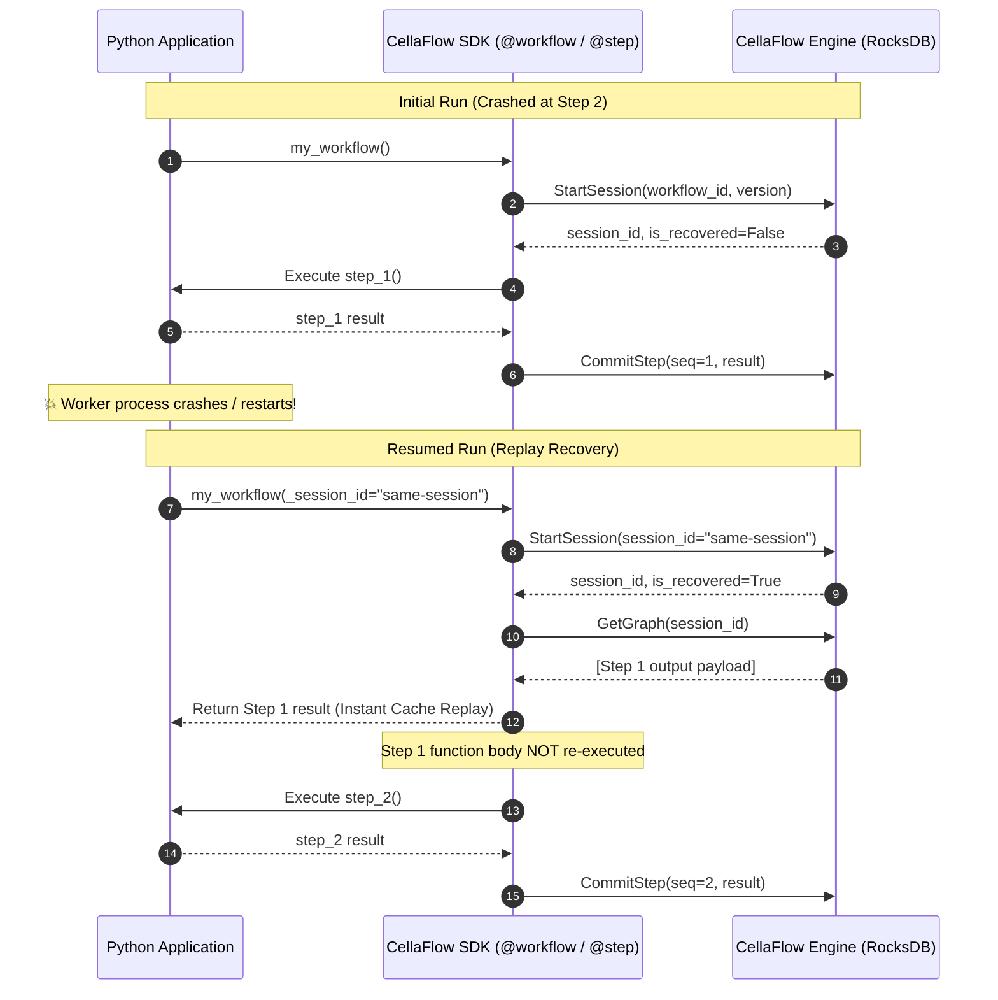
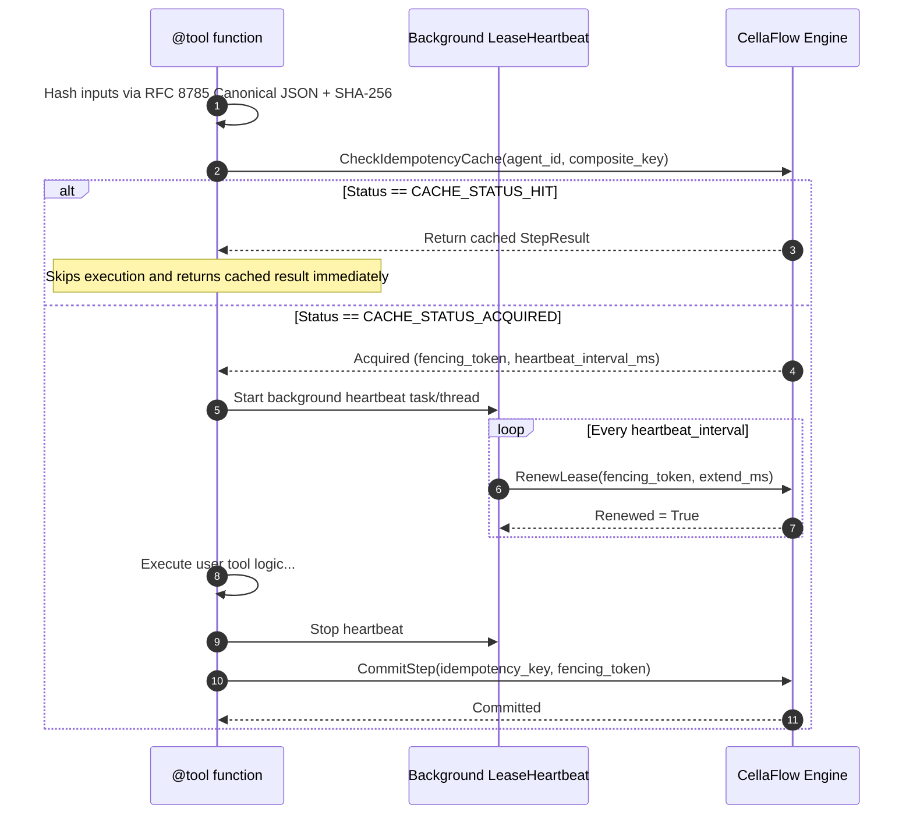

# Cellaflow Python SDK

The official Python SDK for the [CellaFlow Engine](https://github.com/theblueskies/cellaflow) — providing durable execution, deterministic replay recovery, and swarm-safe concurrency primitives for AI workflows and agent graphs.

---

## Features

- **Durable Execution & Transparent Replay**: Run workflows that survive process restarts and infrastructure crashes without re-executing completed external tools or API calls.
- **Zero-Friction Decorators**: Simply annotate standard Python functions with `@workflow`, `@step`, and `@tool`. Dual support for both sync (`def`) and async (`async def`) functions.
- **Deterministic Idempotency**: Automatic input hashing via RFC 8785 Canonical JSON and SHA-256 guarantees cross-language determinism across multi-agent swarms.
- **Background Lease Management**: Non-blocking heartbeat management keeps engine locks alive during long-running tasks and protects against split-brain execution using fencing tokens.
- **Secure Serialization**: Strictly uses MessagePack for all state payloads to optimize throughput and mitigate remote code execution (RCE) attack vectors.

---

## Installation

```bash
pip install cellaflow
```

---

## Quickstart

```python
from cellaflow import workflow, step, tool, IdempotencyScope

# 1. Define tools with automatic caching and idempotency
@tool(scope=IdempotencyScope.SCOPE_SESSION_WIDE)
def search_web(query: str) -> dict:
    """Simulates an expensive API or web search tool."""
    print(f"Executing web search for: {query}")
    return {"query": query, "results": ["CellaFlow Overview", "Durable Execution Docs"]}

# 2. Define intermediate steps
@step
def summarize_results(data: dict) -> str:
    return f"Processed {len(data['results'])} items for '{data['query']}'"

# 3. Define the orchestrating workflow
# By default connects to localhost:50051. You can pass a custom endpoint:
# @workflow(version="1.0.0", target="engine.mycompany.com:50051", secure=True)
@workflow(version="1.0.0")
def research_workflow(topic: str) -> str:
    search_data = search_web(topic)
    summary = summarize_results(search_data)
    return summary

if __name__ == "__main__":
    result = research_workflow("autonomous agent architectures")
    print("Result:", result)
```

---

## How It Works

### 1. Transparent Replay Recovery

When a workflow runs, every step is committed to the CellaFlow engine's durable event log. If the worker crashes mid-workflow, restarting the workflow with the same session automatically recovers state and skips already executed steps:



---

### 2. Idempotency & Lease Lifecycle

For external tool calls and multi-agent coordination, `@tool` prevents duplicate tool calls, single-flights in-progress work, and maintains active lock heartbeats:



---

## Core Concepts

### `@workflow(version="1.0.0", target="localhost:50051", secure=False)`
Marks the entry point for a durable workflow execution. 
- Automatically initializes the underlying gRPC client and execution context.
- Manages replay state when resuming from a crashed or interrupted session.

### `@step` and `@tool`
Decorators for atomic units of execution within a workflow.
- **Idempotency**: Generates a deterministic key based on the function name, session, version, sequence, agent ID, and hashed inputs.
- **Replay Interception**: If a step was already completed in the session history, the SDK returns the cached output immediately without re-running the function body.
- **Lease Heartbeating**: Spawns a background task/thread to keep the engine lease refreshed until the function returns.

### `IdempotencyScope`
Controls how cache hits are shared across the execution graph:
* `IdempotencyScope.SCOPE_SESSION_WIDE` *(Default)*: Results are cached and shared across all agents in the session.
* `IdempotencyScope.SCOPE_AGENT_PRIVATE`: Isolates cache hits to the executing agent.
* `IdempotencyScope.SCOPE_STEP_LOCAL`: Strictly isolates cache hits to the current superstep/turn.

---

## Development Setup

To get up and running with the Python SDK for local development:

1. **Create and activate a virtual environment**:
   ```bash
   cd python
   python3 -m venv venv
   source venv/bin/activate
   ```

2. **Install the SDK in editable mode with development dependencies**:
   ```bash
   pip install -e ".[dev]"
   ```

### Generating Protobufs and Typing Stubs (`.pyi`)

We use `grpcio-tools` and `mypy-protobuf` to generate Python stubs from `.proto` definitions:

```bash
./scripts/generate_protos.sh
```

This compiles protos from `../proto/cellaflow/v1/*.proto` and outputs `*_pb2.py`, `*_pb2_grpc.py`, and `*.pyi` typing stubs into `src/cellaflow/v1/`.

### Running Tests and Linters

```bash
# Run unit tests
pytest

# Formatting & Linting
black src tests
flake8 src tests
mypy src tests
```

---

## License

Apache 2.0 or MIT (see repository root for details).
